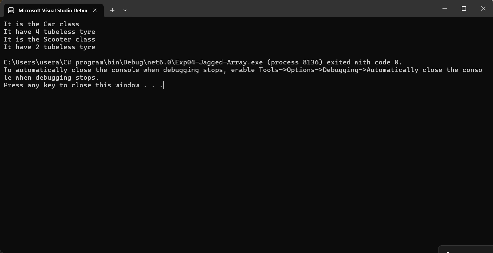

# 19AI308-Object-Oriented-Programming-using-CSharp--Ex7---Hierarchical-Inheritance
# AIM:
To write a C# program to implement heirarchical inheritance for the following problem statement:  All the vehicles need Tyres on their wheels. 
So, the manufacturer designs their vehicle as they want and import Tyre from its base class and fit it into Wheels. 
They don’t need to design Tyre all the time. Once they designed the model and use it various times. 
Aim is to create a Scooter and Car vehicle where the Tyre is being inherited from vehicle class.

# ALGORITHM:
## Step 1: 
Define a base class 'Vehicle' with a method 'tyre' to describe tyres.
## Step 2: 
Create a 'Scooter' class inheriting 'Vehicle', with a method 'Display' and 'tyres'.
## Step 3: 
Implement 'Display' to show class type and call base 'tyre'.
## Step 4: 
Similarly, make a 'Car' class inheriting 'Vehicle', with a 'Display' method.
## Steo 5: 
Instantiate Car' and 'Scooter', call 'Display' with respective tyre counts.

# PROGRAM:
Developed By:SETHUKKARASI C
Register Number:212223230201
```
using System;
public class Inheritance
{
    public static void Main(string[] args)
    {
        Car car = new Car();
        car.Display(4);
        Scooter scooty = new Scooter();
        scooty.Display(2);
    }
}
public class Vehicle
{
    public void tyre(int t)
    {
        Console.WriteLine("It have " + t + " tubeless tyre");
    }
}
public class Scooter : Vehicle
{
    public void Display(int x)
    {
        int tyres = x;
        Console.WriteLine("It is the Scooter class");
        base.tyre(tyres);
    }
}
public class Car : Vehicle
{
    public void Display(int x)
    {
        int tyres = x;
        Console.WriteLine("It is the Car class");
        base.tyre(tyres);
    }
}
```

# OUTPUT:


# RESULT:
Thus, the C# program to implement hierarchical inheritance is verified and executed successfully.